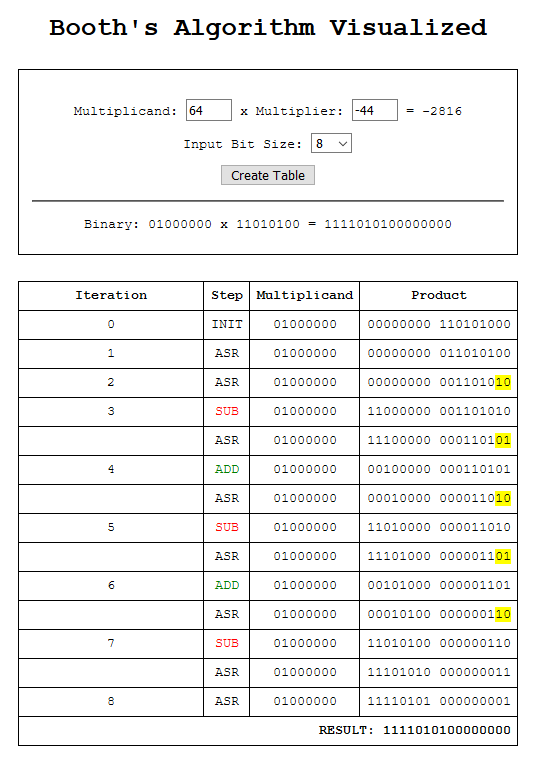

# Booth's Algorithm Visualized

This was a project I completed for a college-level Computer Architecture course. Instead of
visualizing the algorithm on the command line I decided to make a small web-based GUI instead.

This repo is acting as a simple static website being hosted via [GitHub Pages](https://pages.github.com/). You can check it out for yourself here: https://jakob-pb.github.io/booths_alg_visualized/

## Example Screenshot

